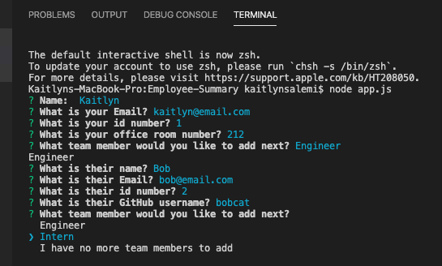
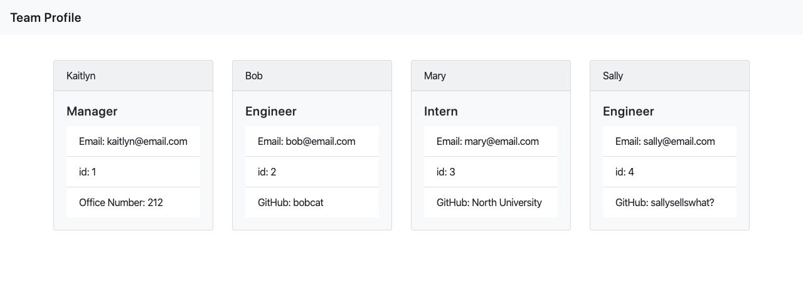

# Employee-Summary

## Objective 
the objective of this application is to create an html page that will have all the information of your team on one page

## Purpose 
As a manager
I want to generate a webpage that displays my team's basic info
so that I have quick access to emails and GitHub profiles

## Process
The manager will be asked a series of questions about themselves and their team members. The information will then be inputed into an html file and displayed on the page in an organized manner.

When the app is run the Manager is asked questions about themselves. They are then asked who they would like to add next

When the Manager chooses Engineer they are asked about the Engineer's name, email, id number, and GitHub username.

When the Manager chooses INtern they are asked about the Intern's name, email, id number, and school name.

The Manager can keep adding Engineers and Interns until they have entered everyone on their list. When the Manager selects "I have no more team memebers to add" they are given a message that their team profile has been completed. 

The Manager can then open the new HTML file in their default browser and view their personalized Team Profile.

